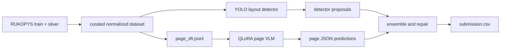

# RUKOPYS HTR

Open-source pipeline for Ukrainian handwritten document recognition on the
[`UkrainianCatholicUniversity/rukopys`](https://huggingface.co/datasets/UkrainianCatholicUniversity/rukopys)
dataset and the Kaggle **Handwritten to Data** task.

The project provides executable tools to:

- download the public RUKOPYS dataset from Hugging Face;
- curate raw train, silver, and test files into normalized JSONL, YOLO labels, crop SFT, and
  full-page JSON SFT data;
- train a YOLO layout detector;
- fine-tune Qwen3-VL models with QLoRA;
- run detector+VLM, full-page VLM, ensemble, or empty-baseline inference;
- build `submission.csv` files for Kaggle;
- publish curated datasets and model adapters to a Hugging Face namespace you control.

No local data, credentials, generated checkpoints, or personal Hub/GitHub namespaces should be
committed. Replace examples such as `your-hf-username-or-org/...` and
`https://github.com/OWNER/REPO.git` with your own values when publishing.

## Repository Layout

- [rukopys_htr/](rukopys_htr/) - CLI implementation and pipeline modules.
- [configs/default.yaml](configs/default.yaml) - default dataset, curation, inference, and training settings.
- [configs/model_presets.yaml](configs/model_presets.yaml) - GPU-oriented QLoRA presets.
- [docs/COLAB.md](docs/COLAB.md) - Colab runbook.
- [docs/PUBLISHING.md](docs/PUBLISHING.md) - Hugging Face and GitHub publishing steps.
- [docs/QWEN3_VL.md](docs/QWEN3_VL.md) - model selection notes.
- [notebooks/colab_quickstart.py](notebooks/colab_quickstart.py) and
  [notebooks/colab_quickstart.ipynb](notebooks/colab_quickstart.ipynb) - Colab quickstart.
- [.env.example](.env.example) - private environment template for your own GitHub/Hugging Face
  account and repo IDs.

## Install

```bash
python3 -m venv .venv
source .venv/bin/activate
pip install -U pip
pip install -e ".[data,dev]"
```

Optional extras:

```bash
pip install -e ".[detector]"   # YOLO training/inference
pip install -e ".[vlm]"        # QLoRA VLM training/inference on Linux GPU
```

For a full local development setup:

```bash
pip install -e ".[data,detector,vlm,dev]"
```

## Private Environment

Copy the example environment file and fill in values for your own accounts:

```bash
cp .env.example .env
```

The `rukopys` CLI reads `.env` automatically from the current working directory. You only need to
source it yourself when using shell variables directly, such as `git remote add origin
"$GITHUB_REMOTE"`:

```bash
set -a
source .env
set +a
```

## Model Choice

The default QLoRA base model is `Qwen/Qwen3-VL-8B-Instruct`.

Recommended presets:

- `colab_t4_fast`: `Qwen/Qwen3-VL-2B-Instruct` for Colab T4 smoke tests.
- `colab_t4_quality`: `Qwen/Qwen3-VL-4B-Instruct` for stronger T4 runs.
- `colab_l4_balanced`: `Qwen/Qwen3-VL-4B-Instruct` for L4.
- `a100_quality`: `Qwen/Qwen3-VL-8B-Instruct` for the default quality run.
- `a100_32b_quality`: `Qwen/Qwen3-VL-32B-Instruct` for A100 80GB experiments.
- `teacher_moe_235b`: `Qwen/Qwen3-VL-235B-A22B-Instruct-FP8` for teacher inference.

See [docs/QWEN3_VL.md](docs/QWEN3_VL.md) for the rationale and source links.

Training uses 4-bit NF4 QLoRA on CUDA. VLM inference also loads base models in 4-bit by default on
CUDA; pass `--no-load-in-4bit` only when you intentionally want fp16/bf16 loading.

## End-to-End Workflow

### 1. Download RUKOPYS

```bash
rukopys download --output data/raw/rukopys
```

Expected source layout:

```text
train/images/*.jpg
train/metadata.jsonl
silver/images/*.jpg
silver/metadata.jsonl
test/images/*.jpg
test/metadata.jsonl
sample_submission.csv
```

### 2. Curate Dataset

```bash
rukopys curate \
  --raw-dir data/raw/rukopys \
  --output-dir data/curated/rukopys_mvp \
  --include-silver \
  --max-silver 1000 \
  --crop-images \
  --num-workers 8
```

Curated outputs:

```text
data/curated/rukopys_mvp/
  README.md
  metadata.jsonl
  regions.jsonl
  vlm_sft.jsonl
  page_sft.jsonl
  page_text_sft.jsonl
  images/{train,silver,test}/
  crops/{train,silver}/
  yolo/data.yaml
  yolo/images/{train,val}/
  yolo/labels/{train,val}/
```

Use `page_text_sft.jsonl` for compact full-page `image -> reading-order text lines` training,
which directly targets PageCER without generating huge bbox JSON. Use `page_sft.jsonl` for
full-page `image -> regions JSON` experiments, and `vlm_sft.jsonl` for crop-level transcription.

### 3. Train Detector

```bash
rukopys train-detector \
  --data-yaml data/curated/rukopys_mvp/yolo/data.yaml \
  --model yolo11n.pt \
  --output-dir runs/detector_mvp \
  --epochs 30 \
  --image-size 1280 \
  --batch 4
```

For stronger experiments, replace `yolo11n.pt` with `yolo11s.pt`, `yolo11m.pt`, or a previous
checkpoint.

### 4. Fine-Tune VLM With QLoRA

Full-page structured baseline:

```bash
rukopys train-vlm-qlora \
  --train-jsonl data/curated/rukopys_mvp/page_sft.jsonl \
  --preset a100_quality \
  --output-dir runs/qwen3_vl_8b_page_qlora \
  --max-steps 1200 \
  --eval-steps 100 \
  --min-quality-weight 0.75
```

Page-text baseline for the strongest next experiment:

```bash
rukopys train-vlm-qlora \
  --train-jsonl data/curated/rukopys_mvp/page_text_sft.jsonl \
  --preset a100_quality \
  --output-dir runs/qwen3_vl_8b_page_text_qlora \
  --max-steps 1800 \
  --eval-steps 100 \
  --min-quality-weight 0.75
```

Colab T4 smoke test:

```bash
rukopys train-vlm-qlora \
  --train-jsonl data/curated/rukopys_mvp/page_text_sft.jsonl \
  --preset colab_t4_fast \
  --output-dir runs/qwen3_vl_2b_page_text_t4_smoke \
  --sample-limit 200 \
  --max-steps 50 \
  --batch-size 1
```

Crop transcription baseline:

```bash
rukopys train-vlm-qlora \
  --train-jsonl data/curated/rukopys_mvp/vlm_sft.jsonl \
  --base-model Qwen/Qwen3-VL-8B-Instruct \
  --output-dir runs/vlm_crop_qlora \
  --max-steps 600 \
  --batch-size 1 \
  --grad-accum-steps 8 \
  --max-length 1024
```

### 5. Run Inference

Full-page VLM:

```bash
rukopys infer \
  --mode page-vlm \
  --test-dir data/raw/rukopys/test \
  --vlm-model runs/qwen3_vl_8b_page_qlora \
  --max-pixels 401408 \
  --batch-size 4 \
  --output-jsonl outputs/page_predictions.jsonl
```

Detector plus page-text VLM, recommended after training a detector:

```bash
rukopys infer \
  --mode detector-page-text \
  --test-dir data/raw/rukopys/test \
  --detector-model runs/detector_mvp/weights/best.pt \
  --vlm-model runs/qwen3_vl_8b_page_text_qlora \
  --max-pixels 1605632 \
  --page-max-new-tokens 1024 \
  --output-jsonl outputs/detector_page_text_predictions.jsonl
```

Detector plus crop VLM:

```bash
rukopys infer \
  --mode detector-vlm \
  --test-dir data/raw/rukopys/test \
  --detector-model runs/detector_mvp/weights/best.pt \
  --vlm-model runs/vlm_crop_qlora \
  --output-jsonl outputs/predictions.jsonl
```

Smoke test without trained models:

```bash
rukopys infer \
  --mode empty \
  --test-dir data/raw/rukopys/test \
  --output-jsonl outputs/empty_predictions.jsonl
```

Create the submission CSV:

```bash
rukopys make-submission \
  --predictions outputs/page_predictions.jsonl \
  --sample-submission data/raw/rukopys/sample_submission.csv \
  --output outputs/submission.csv
```

On Colab T4, cap image resolution to avoid OOM (`262144` for 8B, `131072` if still tight). On an
A100 80GB, start page-VLM inference with `--batch-size 4`, then try `6` or `8` while watching
memory. Match `--max-pixels` to the training preset when possible.

## Publish to Hugging Face

Authenticate:

```bash
hf auth login
hf auth whoami
```

Upload a curated dataset:

```bash
rukopys upload-dataset \
  --dataset-dir data/curated/rukopys_mvp
```

Upload a fine-tuned model folder:

```bash
rukopys upload-model \
  --model-dir runs/qwen3_vl_8b_page_qlora
```

Push directly at the end of training:

```bash
rukopys train-vlm-qlora \
  --train-jsonl data/curated/rukopys_mvp/page_sft.jsonl \
  --base-model Qwen/Qwen3-VL-8B-Instruct \
  --output-dir runs/qwen3_vl_8b_page_qlora \
  --push-to-hub
```

These commands use `HF_DATASET_ID`, `HF_MODEL_ID`, `HF_NAMESPACE`, and `HF_PRIVATE` from `.env`.
Explicit CLI flags such as `--repo-id`, `--hub-model-id`, and `--private` still override defaults.

## Google Colab

Use [notebooks/colab_quickstart.ipynb](notebooks/colab_quickstart.ipynb), or open the paired
[notebooks/colab_quickstart.py](notebooks/colab_quickstart.py) in Colab. The full runbook is in
[docs/COLAB.md](docs/COLAB.md).

Colab guidance:

- T4: use `colab_t4_fast` for smoke tests and `colab_t4_quality` for 4-bit 4B runs.
- L4: use the 4B preset; move to 8B on A100.
- Keep `--batch-size 1` during training and increase `--grad-accum-steps`.
- Mount Google Drive for persistent `data/`, `runs/`, and `outputs/`.
- Push checkpoints to a Hub repo you control with `--push-to-hub`.

## GitHub Publishing

```bash
git status
git add .
git commit -m "Prepare RUKOPYS HTR pipeline"
git remote add origin https://github.com/OWNER/REPO.git
git push -u origin main
```

Do not commit local datasets, checkpoints, credentials, virtual environments, cache folders, or
Hugging Face tokens. See [.gitignore](.gitignore).

## License

Repository code is released under the [MIT License](LICENSE). The upstream RUKOPYS dataset and any
curated derivatives keep their own dataset license terms; review the source dataset card before
redistributing data or trained artifacts.

## Architecture

The highest-upside path is the full-page VLM, not crop-only OCR. The current pipeline supports
both:



Useful next improvements:

- validate against a local split by source and annotation quality;
- add source-specific prompts for dictation, document fragment, math, table, graph, and drawing
  pages;
- ensemble page-VLM JSON with detector boxes to repair missed regions;
- add JSON schema validation plus bbox/text normalization;
- train longer on curated high-quality annotator rows before adding silver data.
