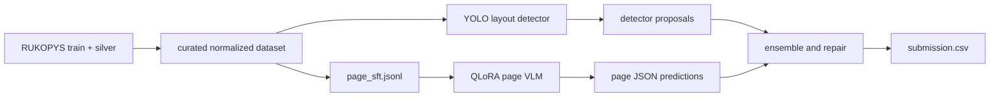

# RUKOPYS HTR Kaggle MVP

Python MVP for Kaggle **Handwritten to Data** using
[`UkrainianCatholicUniversity/rukopys`](https://huggingface.co/datasets/UkrainianCatholicUniversity/rukopys).

This is a working first version with executable pipeline code. It can:

- download the source dataset from Hugging Face;
- curate train/silver/test pages into normalized JSONL, YOLO labels, crop SFT, and full-page JSON SFT;
- train a YOLO layout detector;
- fine-tune a configurable vision-language model with QLoRA;
- run detector+VLM or page-VLM inference;
- create and submit `submission.csv` to Kaggle;
- upload curated datasets and model artifacts to Hugging Face Hub.

## Model Choice

The default QLoRA base model is `Qwen/Qwen3-VL-8B-Instruct`.

It is configurable in three places:

- CLI: `rukopys train-vlm-qlora --base-model MODEL_ID`
- CLI preset: `rukopys train-vlm-qlora --preset colab_t4_fast`
- config: [configs/default.yaml](/Users/alexander/Documents/htr-test/configs/default.yaml)
- presets: [configs/model_presets.yaml](/Users/alexander/Documents/htr-test/configs/model_presets.yaml)

Recommended presets:

- Colab T4: `Qwen/Qwen3-VL-2B-Instruct`
- Colab T4 quality: `Qwen/Qwen3-VL-4B-Instruct` with 4-bit QLoRA
- Colab L4: `Qwen/Qwen3-VL-4B-Instruct`
- A100 quality baseline: `Qwen/Qwen3-VL-8B-Instruct`
- multi-GPU quality baseline: `Qwen/Qwen3-VL-32B-Instruct`
- teacher / external inference baseline: `Qwen/Qwen3-VL-235B-A22B-Instruct-FP8`

Qwen3-VL is the current Qwen vision-language generation. The official lineup includes
dense 2B/4B/8B/32B models and MoE 30B-A3B/235B-A22B models. For this Kaggle pipeline,
8B is the default because it is the strongest practical QLoRA target for a single high-memory GPU.
See [docs/QWEN3_VL.md](/Users/alexander/Documents/htr-test/docs/QWEN3_VL.md) for the model
selection notes.

Quantization is used by default where it matters:

- training uses 4-bit NF4 QLoRA on CUDA;
- VLM inference loads the base model in 4-bit by default on CUDA;
- pass `--no-load-in-4bit` to inference only when you explicitly want fp16/bf16 loading.

## Install

```bash
python3 -m venv .venv
source .venv/bin/activate
pip install -e ".[data,dev]"
```

Optional dependencies:

```bash
pip install -e ".[detector]"   # YOLO training/inference
pip install -e ".[vlm]"        # QLoRA VLM training/inference on Linux GPU
pip install -e ".[kaggle]"     # Kaggle CLI submission
```

## End-to-End Workflow

### 1. Download RUKOPYS

```bash
rukopys download --output data/raw/rukopys
```

Expected source layout:

```text
train/images/*.jpg
train/metadata.jsonl
silver/images/*.jpg
silver/metadata.jsonl
test/images/*.jpg
test/metadata.jsonl
sample_submission.csv
```

### 2. Curate Dataset

```bash
rukopys curate \
  --raw-dir data/raw/rukopys \
  --output-dir data/curated/rukopys_mvp \
  --include-silver \
  --max-silver 1000 \
  --crop-images
```

Curated outputs:

```text
data/curated/rukopys_mvp/
  README.md
  metadata.jsonl
  regions.jsonl
  vlm_sft.jsonl
  page_sft.jsonl
  images/{train,silver,test}/
  crops/{train,silver}/
  yolo/data.yaml
  yolo/images/{train,val}/
  yolo/labels/{train,val}/
```

Use `vlm_sft.jsonl` for crop-level transcription. Use `page_sft.jsonl` for the more competitive full-page `image -> regions JSON` path.

### 3. Train Detector

```bash
rukopys train-detector \
  --data-yaml data/curated/rukopys_mvp/yolo/data.yaml \
  --model yolo11n.pt \
  --output-dir runs/detector_mvp \
  --epochs 30 \
  --image-size 1280 \
  --batch 4
```

For stronger experiments, replace `--model yolo11n.pt` with `yolo11s.pt`, `yolo11m.pt`, or a previous checkpoint.

### 4. Fine-Tune VLM With QLoRA

Crop transcription baseline:

```bash
rukopys train-vlm-qlora \
  --train-jsonl data/curated/rukopys_mvp/vlm_sft.jsonl \
  --base-model Qwen/Qwen3-VL-8B-Instruct \
  --output-dir runs/vlm_crop_qlora \
  --max-steps 600 \
  --batch-size 1 \
  --grad-accum-steps 8 \
  --max-length 1024
```

Full-page structured baseline:

```bash
rukopys train-vlm-qlora \
  --train-jsonl data/curated/rukopys_mvp/page_sft.jsonl \
  --base-model Qwen/Qwen3-VL-8B-Instruct \
  --output-dir runs/qwen3_vl_8b_page_qlora \
  --max-steps 600 \
  --batch-size 1 \
  --grad-accum-steps 8 \
  --max-length 6144 \
  --max-pixels 802816
```

For quick Colab T4 smoke tests:

```bash
rukopys train-vlm-qlora \
  --train-jsonl data/curated/rukopys_mvp/page_sft.jsonl \
  --preset colab_t4_fast \
  --output-dir runs/qwen3_vl_2b_page_t4_smoke \
  --sample-limit 200 \
  --max-steps 50 \
  --batch-size 1
```

For a stronger T4 run, use the 4-bit 4B preset:

```bash
rukopys train-vlm-qlora \
  --train-jsonl data/curated/rukopys_mvp/page_sft.jsonl \
  --preset colab_t4_quality \
  --output-dir runs/qwen3_vl_4b_page_t4 \
  --sample-limit 500 \
  --max-steps 200
```

### 5. Run Inference

Detector plus crop VLM:

```bash
rukopys infer \
  --mode detector-vlm \
  --test-dir data/raw/rukopys/test \
  --detector-model runs/detector_mvp/weights/best.pt \
  --vlm-model runs/vlm_crop_qlora \
  --output-jsonl outputs/predictions.jsonl
```

Full-page VLM:

```bash
rukopys infer \
  --mode page-vlm \
  --test-dir data/raw/rukopys/test \
  --vlm-model runs/qwen3_vl_8b_page_qlora \
  --max-pixels 401408 \
  --output-jsonl outputs/page_predictions.jsonl
```

On Colab T4, cap image resolution to avoid OOM (`262144` for 8B, `131072` if still tight). Match `--max-pixels` to the training preset when possible.

VLM inference uses 4-bit loading by default on CUDA. To disable it:

```bash
rukopys infer \
  --mode page-vlm \
  --test-dir data/raw/rukopys/test \
  --vlm-model runs/qwen3_vl_8b_page_qlora \
  --output-jsonl outputs/page_predictions.jsonl \
  --no-load-in-4bit
```

Create the Kaggle CSV:

```bash
rukopys make-submission \
  --predictions outputs/page_predictions.jsonl \
  --sample-submission data/raw/rukopys/sample_submission.csv \
  --output outputs/submission.csv
```

Smoke test without trained models:

```bash
rukopys infer \
  --mode empty \
  --test-dir data/raw/rukopys/test \
  --output-jsonl outputs/empty_predictions.jsonl
```

## Upload to Hugging Face

Authenticate:

```bash
hf auth login
hf auth whoami
```

Upload curated dataset:

```bash
rukopys upload-dataset \
  --dataset-dir data/curated/rukopys_mvp \
  --repo-id AlexandreSheva/rukopys-curated-mvp \
  --private
```

Upload a fine-tuned model folder:

```bash
rukopys upload-model \
  --model-dir runs/qwen3_vl_8b_page_qlora \
  --repo-id AlexandreSheva/rukopys-qwen3-vl-8b-page-qlora \
  --private
```

You can also push directly at the end of training:

```bash
rukopys train-vlm-qlora \
  --train-jsonl data/curated/rukopys_mvp/page_sft.jsonl \
  --base-model Qwen/Qwen3-VL-8B-Instruct \
  --output-dir runs/qwen3_vl_8b_page_qlora \
  --push-to-hub \
  --hub-model-id AlexandreSheva/rukopys-qwen3-vl-8b-page-qlora
```

For very large folders, use the Hugging Face CLI resumable uploader:

```bash
hf upload-large-folder AlexandreSheva/rukopys-curated-mvp data/curated/rukopys_mvp --type dataset
```

## Submit to Kaggle

Install the Kaggle extra:

```bash
pip install -e ".[kaggle]"
```

Configure credentials:

```bash
mkdir -p ~/.kaggle
# put kaggle.json from https://www.kaggle.com/settings/account into ~/.kaggle/kaggle.json
chmod 600 ~/.kaggle/kaggle.json
```

Accept the competition rules in the Kaggle web UI, then submit:

```bash
rukopys submit-kaggle \
  --submission outputs/submission.csv \
  --message "page-vlm qlora mvp"
```

Equivalent raw Kaggle CLI command:

```bash
kaggle competitions submit \
  -c handwritten-to-data \
  -f outputs/submission.csv \
  -m "page-vlm qlora mvp"
```

## Google Colab

Open [notebooks/colab_quickstart.py](/Users/alexander/Documents/htr-test/notebooks/colab_quickstart.py) as a Colab notebook, or copy the commands from [docs/COLAB.md](/Users/alexander/Documents/htr-test/docs/COLAB.md).

Colab guidance:

- T4: use `colab_t4_fast` for smoke tests and `colab_t4_quality` for 4-bit 4B runs.
- L4: use `Qwen/Qwen3-VL-4B-Instruct`; move to `Qwen/Qwen3-VL-8B-Instruct` on A100.
- Keep batch size at 1 and increase `--grad-accum-steps`.
- Mount Google Drive for persistent `data/`, `runs/`, and `outputs/`.
- Push checkpoints to Hugging Face with `--push-to-hub` so runtime disconnects do not lose the trained adapter.

## GitHub Pipeline

```bash
git add .
git commit -m "Implement RUKOPYS HTR MVP pipeline"
git remote add origin https://github.com/alexandre0sheva/rukopys-htr-solution.git
git push -u origin main
```

Do not commit local datasets, checkpoints, credentials, `.venv`, or Kaggle tokens. They are ignored by [.gitignore](/Users/alexander/Documents/htr-test/.gitignore).

## Architecture for Competitive Iteration

The highest-upside path is the full-page VLM, not crop-only OCR. The current MVP supports both, but the recommended next competition architecture is:



Near-term improvements:

- validate against a local split by source and annotation quality;
- add source-specific prompts for dictation, document fragment, math, table, graph, and drawing pages;
- ensemble page-VLM JSON with detector boxes to repair missed regions;
- add JSON schema validation plus bbox/text normalization;
- train longer on curated high-quality annotator rows before adding silver data.
